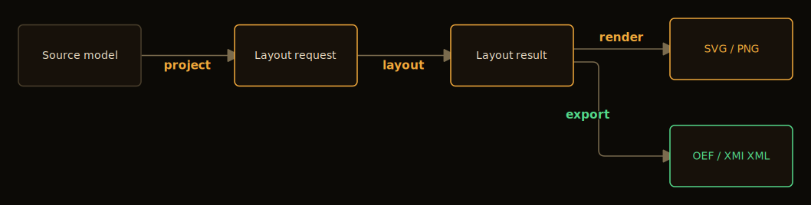

# dediren


`dediren` is a contract-first, single-JVM diagram compiler **for agentic
tools**. It turns semantic JSON into generated layout, rendered SVG,
ArchiMate® 3.2 OEF XML, or UML® 2.5.1 XMI XML through explicit CLI commands
backed by in-process first-party engines. Every command prints a JSON envelope
on stdout, so an agent decides success or failure without scraping stderr.

> [!TIP]
> The primary audience is agents. If you are authoring Dediren JSON or driving a
> bundle, read [`docs/agent-usage.md`](docs/agent-usage.md) — the comprehensive,
> token-efficient authoring and command reference. This README is the human
> front door: what Dediren is, how to build it, and how to cut a release.

## Pipeline



```text
validate → project → layout → validate-layout → render   (SVG)
validate → project → layout → validate-layout → export   (ArchiMate OEF / UML XMI)
```

`dediren build` runs the decomposed flow above as one command per view,
writing each view's artifacts under `--out`; use the stage-by-stage form when
you need to inspect, cache, or persist an intermediate stage envelope.
`validate` guards the source model and `validate-layout` checks the generated
geometry — both are quality gates that emit structured diagnostics. See
[`docs/agent-usage.md`](docs/agent-usage.md) for every command, flag, and
notation.

> The diagram above is **generated by Dediren from its own pipeline**, not drawn
> by hand — [`docs/assets/`](docs/assets/) holds the source model and a
> one-command regeneration.

## Requirements

- Java 21 or newer on `PATH` as `java`.
- The checked-in Maven Wrapper (`./mvnw`) to build.
- `xmllint` on `PATH` for ArchiMate OEF / UML XMI standards validation.
- `curl` on `PATH` only when export validation must fetch a standards schema.
  Offline runs supply schema files via `DEDIREN_OEF_SCHEMA_DIR` /
  `DEDIREN_XMI_SCHEMA_PATH`; behind a proxy, set `HTTP_PROXY` / `HTTPS_PROXY` /
  `NO_PROXY` and the export plugins forward them to `curl`.

## Build And Test

```bash
./mvnw test                                    # unit + integration
./mvnw -Pquality verify                        # google-java-format + SpotBugs gate
./mvnw -Pcoverage verify                       # JaCoCo LINE + BRANCH gate
./mvnw -pl dist-tool -am verify -Pdist-build   # build the agent bundle
./mvnw -pl dist-tool -am verify -Pdist-smoke   # smoke-test the built bundle
```

Auto-fix formatting with `./mvnw -Pquality spotless:apply`. The `quality` and
`coverage` gates fail the build locally; CI runs the same checks report-only.
Narrower per-module verification lanes are listed in
[`CLAUDE.md` §Verification](CLAUDE.md).

Maven state is repo-local under `.cache/maven` for sandbox-friendly builds.
Supply-chain scanning is layered: **Grype** scans the CycloneDX SBOM and is the
blocking CI/release gate (High/Critical advisories fail the build); **OWASP
Dependency-Check** is a non-blocking weekly second opinion (`-Psecurity-sca`
locally; set `NVD_API_KEY` for the authenticated NVD path). Produce the SBOM and
third-party notices with the `-Psbom` and `-Pthird-party-notices` profiles.
Licence hygiene is gated in the same lanes: the cli `package` phase resolves
every runtime dependency's effective-pom licence against an approved allowlist
(`license-maven-plugin`), and the dist build refuses to write
`THIRD-PARTY-NOTICES.md` when that resolved report disagrees with the curated
attribution map — a dependency bump that changes an upstream licence fails the
build instead of shipping a stale label.

`-Pdist-build` writes a platform-neutral archive under `dist/` (launch scripts +
jars, no bundled JRE — Java 21+ is required at runtime):

```text
dist/dediren-agent-bundle-2026.07.22/
dist/dediren-agent-bundle-2026.07.22.tar.xz
```

## First Run

Point `BUNDLE` at an unpacked bundle (the newest local `dist/` build shown), then
validate and build the smallest fixture into SVG in one command:

```bash
BUNDLE=$(ls -d dist/dediren-agent-bundle-* | grep -v '\.tar\.gz$' | sort | tail -1)

"$BUNDLE/bin/dediren" validate \
  --input "$BUNDLE/fixtures/source/valid-basic.json"

"$BUNDLE/bin/dediren" build \
  --input "$BUNDLE/fixtures/source/valid-basic.json" \
  --out out \
  --render-policy "$BUNDLE/fixtures/render-policy/default-svg.json"

cp out/main/diagram.svg diagram.svg
```

`build` chains `project` → `layout` → `validate-layout` → `render`/`export`
for every requested view in one process call and writes each view's artifacts
under `--out/<view-id>/`; read its stdout `.status` and `.views[]` (see
[`docs/agent-usage.md`](docs/agent-usage.md) `## Build`). Run each stage
individually — as below — to inspect, cache, or persist an intermediate stage
envelope with `--emit`:

```bash
"$BUNDLE/bin/dediren" project --target layout-request --plugin generic-graph \
  --view main --input "$BUNDLE/fixtures/source/valid-basic.json" > layout-request.json

"$BUNDLE/bin/dediren" layout --plugin elk-layout \
  --input layout-request.json > layout-result.json

"$BUNDLE/bin/dediren" validate-layout --input layout-result.json

"$BUNDLE/bin/dediren" render --plugin render \
  --policy "$BUNDLE/fixtures/render-policy/default-svg.json" \
  --input layout-result.json > render-result.json

jq -r '.data.artifacts[] | select(.artifact_kind=="svg") | .content' render-result.json > diagram.svg
```

dediren emits SVG only; for a raster image, convert the SVG with an external
tool such as `rsvg-convert`, `resvg`, ImageMagick, or Inkscape.

`"$BUNDLE/bin/dediren" --version` confirms the bundle is runnable. For
ArchiMate/UML notations, exports, accessibility, and failure-repair rules,
follow [`docs/agent-usage.md`](docs/agent-usage.md).

Runs are quiet by default. When something needs investigating, set
`DEDIREN_LOG_LEVEL=debug` for a window into engine dispatch, ELK layout size and
timing, schema-cache hits, and the `xmllint` validator:

```bash
DEDIREN_LOG_LEVEL=debug "$BUNDLE/bin/dediren" layout --plugin elk-layout \
  --input layout-request.json > layout-result.json
```

Logs go to stderr and stdout stays a clean JSON envelope, so piping to `jq` keeps
working with logging on. Logs are for humans — agents decide from stdout.

### MCP server

Agents can drive Dediren as MCP tools instead of the CLI:

    claude mcp add dediren -- "$BUNDLE/bin/dediren" mcp --root /path/to/your/project

This serves `dediren_validate`, `dediren_build`, and `dediren_guide` (the agent
guide, one section at a time) over stdio. Tool paths are confined to `--root` —
point it at your project directory, since a bare `.` resolves to wherever the
client spawns the server, not necessarily your project. `--read-only` withholds
the build tool. See `docs/agent-usage.md`.

## Bundle Layout

```text
dediren-agent-bundle-2026.07.22/
  bin/dediren     the single launcher (hosts all five engines in-process)
  lib/            one shrink-merged classpath jar (no bundled JRE)
  schemas/        public JSON schemas
  fixtures/       source, policy, layout, render, and export examples
  docs/agent-usage.md
  LICENSE · THIRD-PARTY-NOTICES.md · bundle.json
```

The `dediren` launcher sets `DEDIREN_BUNDLE_ROOT` so commands resolve bundled
`schemas/`, `fixtures/`, and `bin/` from any working directory. The five
first-party engines are compiled into the CLI; there is no runtime plugin
discovery of any kind — see [`docs/threat-model.md`](docs/threat-model.md) for
the single-JVM trust boundary.

For the full set of runtime-environment variables, see
[`docs/agent-usage.md`](docs/agent-usage.md).

## Notations

Dediren source models are semantic and plugin-typed — no positions, sizes,
colors, or fonts in source JSON; geometry is generated and presentation lives in
render policy. One source model can drive several notations:

- **Generic** graph views (`generic-graph` profile).
- **ArchiMate® 3.2** SVG and OEF XML (`archimate` profile, `archimate-oef`
  plugin; the emitted model validates against the ArchiMate 3.1 OEF exchange
  schema, the latest The Open Group publishes).
- **UML® 2.5.1** SVG and XMI XML (`uml` profile, `uml-xmi` plugin): class, data,
  activity, sequence, state-machine, use-case, component, and deployment views.

[`docs/agent-usage.md`](docs/agent-usage.md) carries the per-notation authoring
vocabulary, command handoffs, and layout-preference options; the machine
contract is the JSON in [`schemas/`](schemas/).

## Release

Releases use CalVer `YYYY.0M.MICRO` — the version encodes the release date, not
compatibility, so call out breaking product/plugin contract changes in the
release notes and through schema-id changes. The version source is root
`pom.xml`; set it across all modules with:

```bash
./mvnw versions:set -DnewVersion='2026.07.22' -DprocessAllModules=true -DgenerateBackupPoms=false
```

Then sync the checked-in version surfaces (source-fixture
`required_plugins[].version` entries, the bundle examples in this file and
`docs/agent-usage.md`, and the version-assertion tests) — the exhaustive surface
list lives in [`CLAUDE.md` §Versioning](CLAUDE.md). Commit the bump on its own,
then tag the bump commit:

```bash
git tag -a v2026.07.22 -m "Release 2026.07.22"
```

`dist-build` is hermetic and self-verifying — it regenerates each module's
staging directory, verifies the staged jars against the launcher classpath,
shrinks them into the single `lib/dediren-bundle-<version>.jar` (a shrink-only
ProGuard pass; third-party licence files ride inside it under
`META-INF/third-party/`), and fails if the packaged `lib/` diverges from that
one jar — so a locally built archive is safe to distribute without a
preceding `clean`. GitHub Releases publish one Java archive, `SHA256SUMS`, and
CycloneDX SBOMs with GitHub artifact attestations; verify a download with:

```bash
gh attestation verify dediren-agent-bundle-<version>.tar.xz --repo tommimarkus/dediren
```
