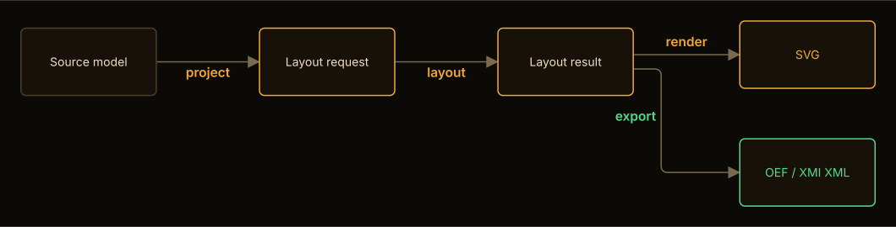

# dediren


`dediren` is a contract-first, single-JVM diagram compiler **for agentic
tools**. It turns semantic JSON into generated layout, rendered SVG,
ArchiMate® Open Exchange Format 3.1 XML, or UML® 2.5.1 XMI XML through CLI commands
backed by in-process first-party engines. Every command prints a JSON envelope
on stdout, so an agent decides success or failure without scraping stderr.

> [!TIP]
> The primary audience is agents. If you are authoring Dediren JSON or driving a
> bundle, read [`docs/agent-usage.md`](docs/agent-usage.md) — the comprehensive,
> token-efficient authoring and command reference. This README is the human
> front door: what Dediren is, how to build it, and how to cut a release.

## Pipeline



```text
Mermaid flowchart / Graphviz DOT file → import → Dediren source model
validate → project → layout → validate-layout → render   (SVG)
validate → project → layout → validate-layout → export   (ArchiMate OEF / UML XMI)
```

`dediren build` runs the decomposed flow above as one command per view,
writing each view's artifacts under `--out`; use the stage-by-stage form when
you need to inspect, cache, or persist an intermediate stage envelope.
`validate` guards the source model and `validate-layout` checks the generated
geometry — both are quality gates that emit structured diagnostics. Beyond
the pipeline, `dediren diff` compares two model revisions, `dediren query`
answers fixed impact questions (dependents, orphans, view coverage), and
build artifacts carry deterministic provenance stamps that `dediren verify`
turns into a CI drift gate ("are these diagrams still current?") with
`dediren status` as the workspace freshness index. See
[`docs/agent-usage.md`](docs/agent-usage.md) for every command, flag, and
notation.

`dediren import --plugin mermaid [--input <path>]` converts the documented
Mermaid 11.16.1 flowchart subset into generic-graph source JSON, including
bounded multiline statements, label-only `<br>` newlines, and solid directed
or undirected edges. It is a one-way conversion; unsupported or unsafe syntax
fails atomically with structured diagnostics. The corresponding
`dediren import --plugin dot [--input <path>]` command handles a supported
subset of Graphviz DOT —
graphs, digraphs, comma-separated node declarations, edges, subgraphs and
clusters — with unsupported constructs reported, not silently dropped; see
`docs/agent-usage.md` for the exact mapping and its known limitations.

For MCP clients, prefer prompt-first inline import when the diagram is already
in the conversation: pass exactly one `content` string, `plugin: "mermaid"` or
`"dot"`, and use `output: "image"` with `accepted_image_types` when an image is
useful (`"data"` is the default). Examples are
`flowchart LR\n  client --> api` and `digraph { client -> api }`. The JSON
envelope remains the first result content; Dediren then prefers
`image/svg+xml` over `image/png` regardless of list order. PNG is an optional
MCP response attachment produced from the SVG by a configured `resvg`; it is
not a render artifact, and an unavailable or failed converter falls back to
JSON only. `output: "svg"` remains the strict force-SVG selector. Import uses
the bundled default SVG policy unless `render_policy` is supplied. The same
selectors are available to `dediren_build`, where a source-mode negotiated or
forced attachment requires an explicit policy; see the agent guide for limits
and the complete contract.

> The diagram above is **generated by Dediren from its own pipeline**, not drawn
> by hand — [`docs/assets/`](docs/assets/) holds the source model and a
> one-command regeneration.

## Architecture

Dediren is a **contract-first modular monolith**: a Maven reactor of small
modules with an explicit, acyclic dependency graph rooted at `contracts`. The
diagram below is that module architecture **modelled by Dediren from itself** —
an ArchiMate® Application Cooperation view compiled through the same
`project → layout → render` pipeline shown above.


Four stability-tier bands read left to right: the `contracts` kernel (in
emerald) and the `ir` spine, then the notation/utility cores and the
`engine-api` seam, then orchestration `core` and the eight engines behind the
seam, and finally the thin `cli` entrypoint with its `mcp-server` adapter and
`dist-tool`. Three companion **UML®** views zoom in: a **class** view of the
`engine-api` seam — the typed `SemanticsEngine` / `LayoutEngine` /
`RenderEngine` / `ExportEngine` / `ImportEngine` interfaces and the engine classes that realise
them; a **sequence** view tracing one `dediren build` through those same
interfaces; and a **deployment** view of how Dediren ships — the single
`bin/dediren` launcher hosting every engine in-process.

All four views, plus the ArchiMate OEF and UML XMI exports Dediren produced from
them, are published as the [self-model documentation site](https://tommimarkus.github.io/dediren/)
and remain available in the checked-in
[`docs/architecture/dediren.dediren/`](docs/architecture/dediren.dediren/)
package. The `Serving` arrows run from a module to the modules that depend on
it, so the bands — not the arrowheads — carry the layering; the hero view shows
the architecturally significant compile edges, with the full edge set in
[`docs/architecture-guidelines.md`](docs/architecture-guidelines.md) §2.

## Requirements

- Java 21 or newer on `PATH` as `java`.
- The checked-in Maven Wrapper (`./mvnw`) to build.
- No external schema fetcher: export validation downloads pinned standards
  schemas with the Java HTTP client. Offline runs supply schema files via
  `DEDIREN_OEF_SCHEMA_DIR` / `DEDIREN_XMI_SCHEMA_PATH`; proxy configuration is
  documented in the agent guide.
- Optional: `resvg` for negotiated MCP `image/png` attachments. It is not
  bundled; launch `dediren mcp` with `--resvg-command` to select a bare `PATH`
  name or absolute executable. The external executable is available under
  MIT OR Apache-2.0 and, because it is not distributed with Dediren, has no
  entry in Dediren's `THIRD-PARTY-NOTICES.md`.

## Build And Test

```bash
./mvnw test                                    # unit + integration
./mvnw -Pquality verify                        # google-java-format + SpotBugs gate
./mvnw -Pcoverage verify                       # JaCoCo LINE + BRANCH gate
./scripts/test-render-paint.sh                  # Chromium SVG paint + raster goldens
./mvnw -pl dist-tool -am verify -Pdist-build   # build the agent bundle
./mvnw -pl dist-tool -am verify -Pdist-smoke   # smoke-test the built bundle
```

Auto-fix formatting with `./mvnw -Pquality spotless:apply`. The `quality` and
`coverage` gates fail the build locally; validation is local-first. The main CI
workflow runs only on pull requests (chiefly Dependabot bumps) and on demand;
CodeQL and render-paint run weekly and on demand, while release tags have their
own gates. Narrower per-module verification lanes are listed in
[`CLAUDE.md` §Verification](CLAUDE.md).

Normal tests enforce Dediren's standards-derived SVG 2 subset across the
supported generation corpus, including renderer scenarios and provenance-stamped
package and CLI build artifacts. The assertion uses only the JDK's hardened XML
parser and local grammar checks; it adds no validator dependency, download,
network call, or system-tool requirement. This is a bounded generated-output
contract, not full SVG 2 certification or runtime validation of arbitrary SVG;
see [SVG Rendering](docs/features/svg-render.md#generated-svg-2-subset).

The opt-in `render-paint` profile uses Playwright Java 1.61.0 with Chromium
headless shell 149.0.7827.55 (revision 1228) to check decorated SVG paint and
four raster baselines: the rich graph in light and dark themes, ArchiMate
decorators, and UML sequence-fragment chrome. Run the full lane with the script
above, the paint audit alone with
`./scripts/test-render-paint.sh -Dtest='SvgPaintAudit*Test'`, or the raster lane
with
`./scripts/test-render-paint.sh -Dtest='RasterDiffTest,RasterGoldenTest'`.
Deliberate raster changes require
`-Ddediren.render.paint.regenerate-goldens=true`; review the tracked PNG and
manifest diff. Regeneration is accepted only when the browser, Playwright,
container, Java runtime, viewport, DPR, and font match the manifest pins.
Failures write actual, changed-pixel mask, and overlay evidence under
`.test-output/render-paint/`.

Goldens are regression snapshots of reviewed output, not a standalone quality
standard. Layout changes must also satisfy `validate-layout` and be inspected
as rendered diagrams before their fixture, SVG, or raster baselines are moved.

Browser DOM geometry, computed styles, marker/filter paint, and transparent
screenshots are authoritative for this Chromium-only lane; ImageIO still owns
PNG comparison. The browser runs with network and animation disabled, a fixed
locale and UTC timezone, reduced motion, DPR 1, and deterministic padding
around the SVG-derived viewport. Each render gets a disposable, non-persistent
browser context with service workers blocked; every page request is recorded
and aborted. Chromium background networking, updates, sync, crash reporting,
extensions/default apps, first-run/default-browser services, translation,
media routing, and optimization lookups are disabled. The lane does not change
emitted SVG or other product output. It exists only under the opt-in profile,
so the default build and shipped Dediren runtime resolve no Playwright or
browser component.

The existing Liberation Sans test asset is loaded through a data `@font-face`
and its adjacent OFL-1.1-RFN licence and digest remain recorded in the raster
manifest. System-font fallback and fallback-font downloads are prohibited for
blocking text checks; unsupported glyphs are advisory rather than silently
measured with a host font. Repository-owned themes gate on numeric contrast
baselines of 4.5:1 for normal text and 3:1 for large text. These are repository
baselines, not claims of WCAG conformance. User themes never block, and
gradients or compositions that cannot be resolved report `not_measurable`.

Maven state stays under `.cache/maven`, while the wrapper installs only the
pinned Chromium headless shell under `.cache/playwright`; neither cache is
committed or shipped. The scheduled lane uses the digest-pinned Playwright Java
1.61.0 Noble container and Eclipse Temurin 21.0.10+7. The image name, browser
name, and version strings are upstream tool identification, not bundled marks
or product branding. References to the retired paint implementation remain
only in historical plans/reviews under `docs/superpowers` and in threat-model
history; those records are retained rather than rewritten as current guidance.
Supply-chain scanning is layered: **Grype** scans the CycloneDX SBOM and is the
blocking gate on every pull request and release (High/Critical advisories fail
the build); **OWASP Dependency-Check** is an on-demand local second opinion
(`-Psecurity-sca`; set `NVD_API_KEY` for the authenticated NVD path); Dependabot
alerts cover advisories published between runs. Produce the SBOM and
third-party notices with the `-Psbom` and `-Pthird-party-notices` profiles.
Licence hygiene is gated in the same lanes: the cli `package` phase resolves
every runtime dependency's effective-pom licence against an approved allowlist
(`license-maven-plugin`), and the dist build refuses to write
`THIRD-PARTY-NOTICES.md` when that resolved report disagrees with the curated
attribution map — a dependency bump that changes an upstream licence fails the
build instead of shipping a stale label.

Optionally enable the repo-local pre-commit secret scan — a shift-left companion
to GitHub's server-side scanning: `git config core.hooksPath .githooks` (see
[`.githooks/README.md`](.githooks/README.md)). It runs `gitleaks` over staged
changes when installed, and skips with a note otherwise.

`-Pdist-build` writes a platform-neutral archive under `dist/` (launch scripts +
jars, no bundled JRE — Java 21+ is required at runtime):

```text
dist/dediren-agent-bundle-2026.08.5/
dist/dediren-agent-bundle-2026.08.5.tar.xz
```

## First Run

Point `BUNDLE` at an unpacked bundle (the newest local `dist/` build shown), then
validate and build the smallest fixture into SVG in one command:

```bash
BUNDLE=$(ls -d dist/dediren-agent-bundle-* | grep -v '\.tar\.gz$' | sort | tail -1)

"$BUNDLE/bin/dediren" validate \
  --input "$BUNDLE/fixtures/source/valid-basic.json"

"$BUNDLE/bin/dediren" build \
  --input "$BUNDLE/fixtures/source/valid-basic.json" \
  --out out \
  --render-policy "$BUNDLE/fixtures/render-policy/default-svg.json"

cp out/main/diagram.svg diagram.svg
```

To build a whole **package** — several views across several models, each with its
own render policy and declared output path, plus view- or model-scoped exports —
in one call, pass `--package package.json` (or a directory whose `package.json`
to read). It writes each artifact to its declared path and returns one command
envelope wrapping a `package-build-result`; see
[`docs/agent-usage.md`](docs/agent-usage.md) `## Build`.

`build` chains `project` → `layout` → `validate-layout` → `render`/`export`
for every requested view in one process call and writes each view's artifacts
under `--out/<view-id>/`; read its stdout `.status` and `.views[]` (see
[`docs/agent-usage.md`](docs/agent-usage.md) `## Build`). Run each stage
individually — as below — to inspect, cache, or persist an intermediate stage
envelope with `--emit`:

```bash
"$BUNDLE/bin/dediren" project --target layout-request --plugin generic-graph \
  --view main --input "$BUNDLE/fixtures/source/valid-basic.json" > layout-request.json

"$BUNDLE/bin/dediren" layout --plugin elk-layout \
  --input layout-request.json > layout-result.json

"$BUNDLE/bin/dediren" validate-layout --input layout-result.json

"$BUNDLE/bin/dediren" render --plugin render \
  --policy "$BUNDLE/fixtures/render-policy/default-svg.json" \
  --input layout-result.json > render-result.json

jq -r '.data.artifacts[] | select(.artifact_kind=="svg") | .content' render-result.json > diagram.svg
```

The render engine and ordinary CLI emit SVG only; for a raster artifact,
convert the SVG with an external tool such as `rsvg-convert`, `resvg`,
ImageMagick, or Inkscape. The MCP adapter can instead negotiate an optional PNG
response attachment without widening the render contract.

`"$BUNDLE/bin/dediren" --version` confirms the bundle is runnable. For
ArchiMate/UML notations, exports, accessibility, and failure-repair rules,
follow [`docs/agent-usage.md`](docs/agent-usage.md).

Runs are quiet by default. When something needs investigating, set
`DEDIREN_LOG_LEVEL=debug` for a window into engine dispatch, ELK layout size and
timing, schema-cache hits, and the in-JVM schema validation step:

```bash
DEDIREN_LOG_LEVEL=debug "$BUNDLE/bin/dediren" layout --plugin elk-layout \
  --input layout-request.json > layout-result.json
```

Logs go to stderr and stdout stays a clean JSON envelope, so piping to `jq` keeps
working with logging on. Logs are for humans — agents decide from stdout.

### MCP server

Agents can drive Dediren as MCP tools instead of the CLI:

    claude mcp add dediren -- "$BUNDLE/bin/dediren" mcp --root /path/to/your/project

To enable negotiated PNG attachments with an explicit executable:

    claude mcp add dediren -- "$BUNDLE/bin/dediren" mcp --root /path/to/your/project --resvg-command /absolute/path/to/resvg

This serves eight tools over stdio: `dediren_import`, `dediren_validate`, `dediren_build`, the
read-only analysis pair `dediren_diff` and `dediren_query`, the provenance pair
`dediren_verify` and `dediren_status`, and `dediren_guide` (the agent guide, one
section at a time). Tool paths and source-mode output destinations are confined
to `--root`; package outputs are at the paths declared relative to their
package directory. Point `--root` at your project directory, since a bare
`.` resolves to wherever the client spawns the server, not necessarily your
project. `--read-only` withholds only the artifact-writing build tool. This is
breaking for new 2026.08.3 workspace-handle clients but restorative for earlier
clients: do not pass `workspace_id`. Existing `.dediren/mcp/workspaces/`
files are neither migrated nor deleted automatically; recover wanted artifacts
and remove the residue manually. Tool results are JSON-first; `output: "image"`
adds only a successfully negotiated SVG or PNG attachment and otherwise leaves
the envelope unchanged. See `docs/agent-usage.md`.

## Bundle Layout

```text
dediren-agent-bundle-2026.08.5/
  bin/dediren     the single launcher (hosts all bundled engines in-process)
  lib/            one shrink-merged classpath jar (no bundled JRE)
  schemas/        public JSON schemas
  fixtures/       source, policy, layout, render, and export examples
  docs/agent-usage.md
  LICENSE · THIRD-PARTY-NOTICES.md · bundle.json
```

The `dediren` launcher sets `DEDIREN_BUNDLE_ROOT` so commands resolve bundled
`schemas/`, `fixtures/`, and `bin/` from any working directory. The bundled
first-party engines are compiled into the CLI; there is no runtime plugin
discovery of any kind — see [`docs/threat-model.md`](docs/threat-model.md) for
the single-JVM trust boundary.

For the full set of runtime-environment variables, see
[`docs/agent-usage.md`](docs/agent-usage.md).

## Notations

Dediren source models are semantic and plugin-typed — no positions, sizes,
colors, or fonts in source JSON; geometry is generated and presentation lives in
render policy. One source model can drive several notations:

- **Generic** graph views (`generic-graph` profile).
- **ArchiMate® 3.2** SVG and OEF XML (`archimate` profile, `archimate-oef`
  plugin; the emitted model validates against the ArchiMate 3.1 OEF exchange
  schema, the latest The Open Group publishes).
- **UML® 2.5.1** SVG and XMI XML (`uml` profile, `uml-xmi` plugin): class, data,
  activity, sequence, state-machine, use-case, component, and deployment views;
  successful XMI results include schema-governed per-kind scope, a validation
  outcome reporting what the available schemas actually checked, and coverage
  assurance.

[`docs/agent-usage.md`](docs/agent-usage.md) carries the per-notation authoring
vocabulary, command handoffs, and layout-preference options; the machine
contract is the JSON in [`schemas/`](schemas/). Schema-validity is necessary but
not always sufficient: the export lanes carry constraints their own JSON schemas
do not express — the ArchiMate exchange format types diagram coordinates more
narrowly than a layout result does, for instance — so an export can clamp
geometry or decline input that validated cleanly. Those cases are declared in
`.diagnostics[]` rather than left to be discovered from the output.

## Release

Releases use CalVer `YYYY.0M.MICRO` — the version encodes the release date, not
compatibility, so call out breaking product/plugin contract changes in the
release notes and through schema-id changes. The version source is root
`pom.xml`; set it across all modules with:

```bash
./mvnw versions:set -DnewVersion='2026.08.5' -DprocessAllModules=true -DgenerateBackupPoms=false
```

Then sync the checked-in version surfaces (source-fixture
`required_plugins[].version` entries, the bundle examples in this file and
`docs/agent-usage.md`, and the version-assertion tests) — the exhaustive surface
list lives in [`CLAUDE.md` §Versioning](CLAUDE.md). Commit the bump on its own,
then tag the bump commit:

```bash
git tag -a v2026.08.5 -m "Release 2026.08.5"
```

`dist-build` is hermetic and self-verifying — it regenerates each module's
staging directory, verifies the staged jars against the launcher classpath,
shrinks them into the single `lib/dediren-bundle-<version>.jar` (a shrink-only
ProGuard pass; third-party licence files ride inside it under
`META-INF/third-party/`), and fails if the packaged `lib/` diverges from that
one jar — so a locally built archive is safe to distribute without a
preceding `clean`. GitHub Releases publish one Java archive, `SHA256SUMS`, and
CycloneDX SBOMs with GitHub artifact attestations; verify a download with:

```bash
gh attestation verify dediren-agent-bundle-<version>.tar.xz --repo tommimarkus/dediren
```

The archive, both CycloneDX SBOMs, and `SHA256SUMS` are attested together, so
`gh attestation verify` covers every published asset, and the publish job
checks the assets against the attested `SHA256SUMS` before releasing.
Repository release immutability is enabled, so a published release's tag and
asset set are frozen against post-publish tampering (releases published before
2026-07-23 predate the setting and remain mutable). The release workflow
creates each release as a draft with all assets attached, then publishes in
one transition, so an immutable release always carries the complete, attested
asset set.
